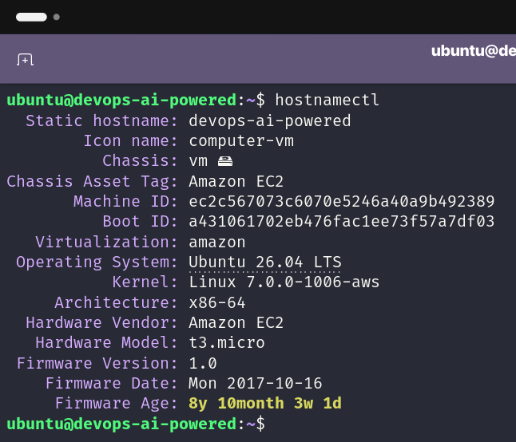
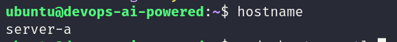
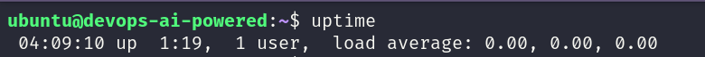
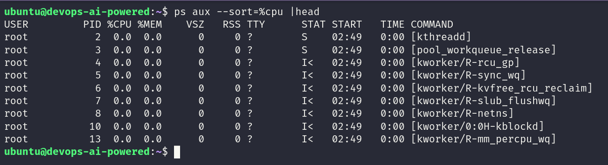
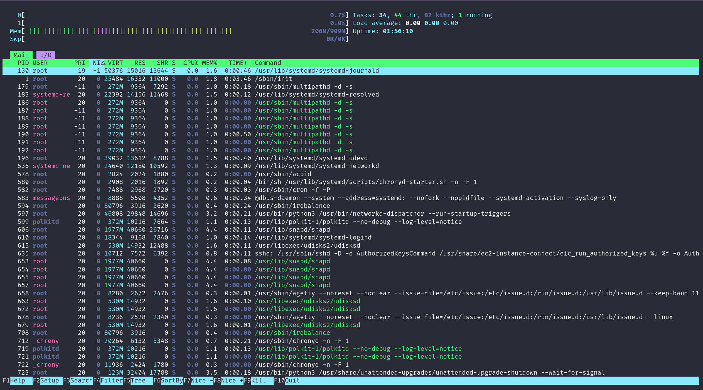
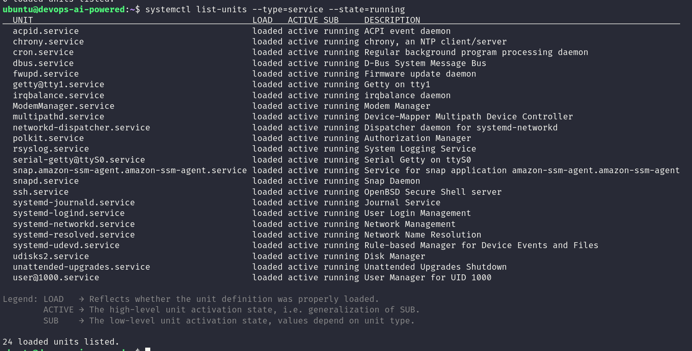
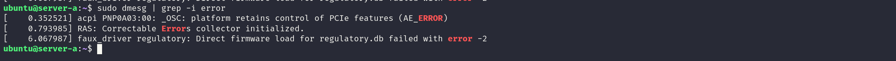

# 🐧Day 04 – Linux Practice: Processes and Services

**Goal:** Practice Linux fundamentals with real, hands-on commands.
* * *
## Hostname Commands 
## 1. Switches to the root user (Super User)

`sudo su ` - Switches your current terminal session to the root user (the system administrator.

## 2. View Current Hostname
`hostnamectl ` : Show all system details and host name information . 

* * *
## 3. Change the Hostname 
`sudo hostnamectl set-hostname server-a` : Change the system hostname.

* * *
# Process checks
## 4. Check System Uptime
`uptime` : Shows how long the system has been running and load averages.

## 5. Find High CPU Consuming Processes
`ps aux --sort=%cpu |head` : Lists processes consuming the most CPU.

## 6. Find real-time CPU and memory usage, live-updating.
`htop` : To tracks live CPU, RAM, Swap, and Disk activity.

* * *
# Service Commands (systemd)
## 7. Check SSH Service Status
`sudo systemctl status ssh` : Shows the current status of a servi whether it's active, inactive, or stopped. 

## 8. List Running Services
`systemctl list-units --type=service --state=running` : 
Shows all currently running services.

## 9. Check service is currently enabled or not 
`systemctl is-enabled ssh` :  To check SSH is start automatically whenever the server boots up. 
* * *
# Log Commands 
## 10. Inspecting kernel/system messages 
`dmesg` : To inspect the kernel ring buffer, which stores messages generated by the Linux kernel; -T shows with the humanreadable timestamp . 

## 11. View SSH Logs
`journalctl -u ssh | tail -10` : Shows logs for the ssh service — login attempts, failures, successes; -u for filtering logs for a specific systemd service; -f for  streaming logs in real-time; -b for logs from current boot.

Note : `systemctl` tells you the state and `journalctl` helps you find the reason/evidence.

