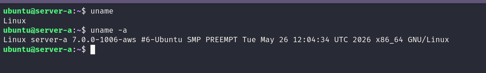
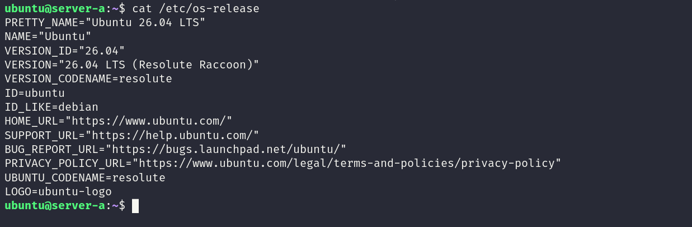
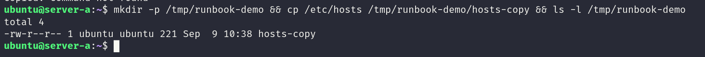
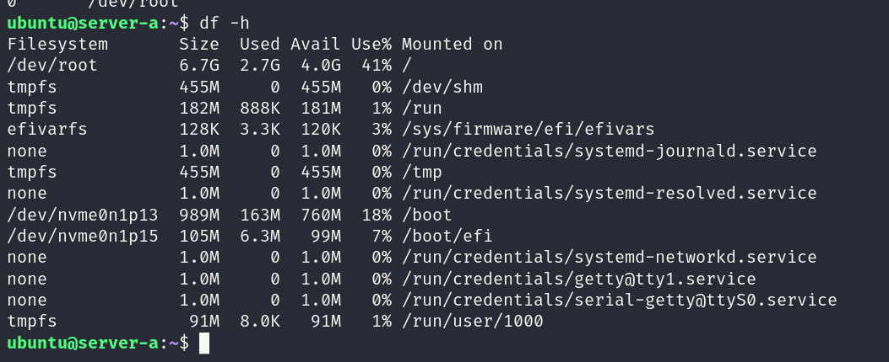
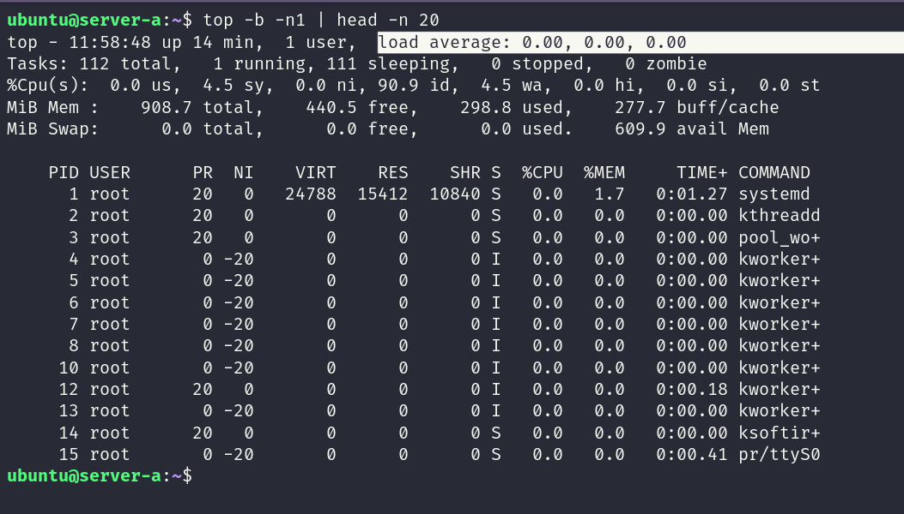
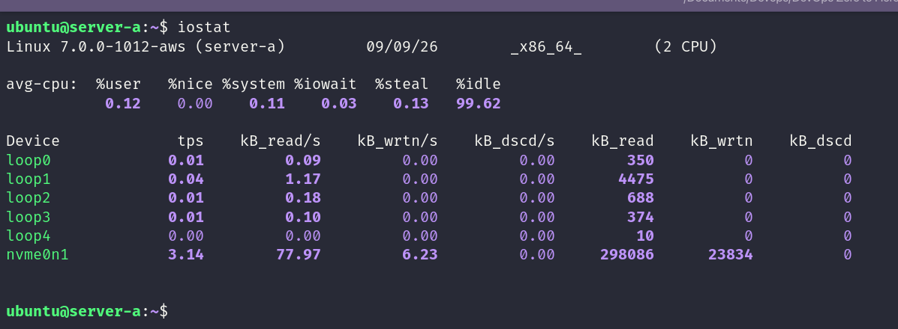
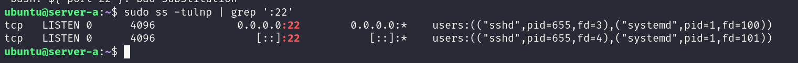
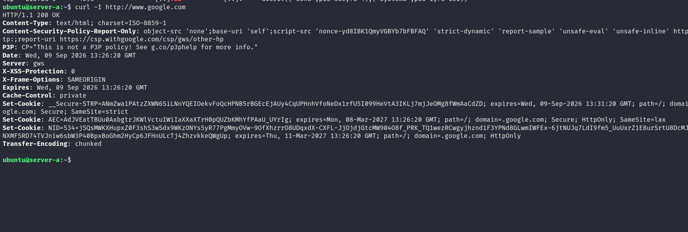
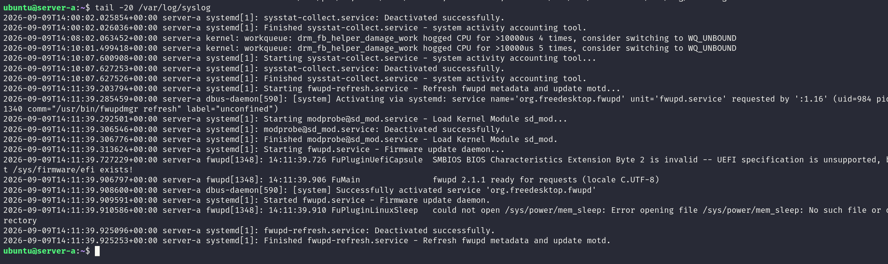

# 🐧 Day 05 – Linux Troubleshooting Drill: CPU, Memory, and Logs

**Goal:** Run a focused troubleshooting drill on a target service, capture a health snapshot, review logs, and build a simple mini runbook.

---

**Target Service:** SSH

---

## Environment Basics

**Before troubleshooting, understand the machine:**

`uname -a` - Shows the Linux kernel version and system architecture.

**Observation:** Linux server with a `7.0.0...` kernel on `x86_64` architecture.

`cat /etc/os-release` - Shows the Linux distribution and version.

---

## Filesystem Sanity Check

`mkdir -p /tmp/runbook-demo && cp /etc/hosts /tmp/runbook-demo/hosts-copy && ls -l /tmp/runbook-demo` - Creates a temporary directory, copies a file, and verifies that the file can be created and accessed successfully.

`df -h /var /` - Checks available disk space on `/var` and the root filesystem. Root usage is around 41%, so there is no immediate disk-space concern.

---

## CPU / Memory

**Checks whether CPU or memory could be affecting the system.**

`ps -o pid,pcpu,pmem,comm -p 642` - Shows CPU and memory usage for the selected SSH process.

`top -b -n 1 | head -n 20` - Takes a one-time snapshot of CPU, memory, load, and running processes.

**Observation:** CPU usage is very low and the load average is `0.00, 0.00, 0.00`, so there is no obvious CPU pressure.

`free -h` - Shows total, used, available memory, and swap usage.

**Observation:** Around 611 MiB memory is available and swap is unused, so there is no obvious memory pressure.

---

## Disk / I/O

**Checks whether storage capacity or disk activity could be slowing the system.**

`df -h` - Checks filesystem space and confirms whether the disk is getting full.

`du -sh /var/log` - Shows the total size of `/var/log`. The log directory is small and not a concern.

`iostat -xz 1` - Shows detailed disk I/O activity and refreshes every second. No unusual I/O wait or disk saturation was observed.

---

## Network

`ss -tulpn` - Shows listening TCP/UDP ports and the processes using them. `0.0.0.0:22` confirms that SSH is listening on port 22.

`curl -I http://www.google.com` - Sends an HTTP request and displays only the response headers. A `200 OK` response confirms outbound HTTP connectivity.

---

## Logs

`sudo journalctl -u ssh -n 50` - Shows the latest SSH service logs. The logs contain repeated login attempts from `78.82.199.124` using invalid usernames such as `oracle`, `usuario`, `test`, `user`, and `ftpuser`.

`tail -20 /var/log/syslog` - Shows the latest system log entries. Most entries are normal, with a few kernel and `fwupd` warnings but no clear critical SSH failure.

---

## Mini Runbook (what I did)

- Captured environment and OS: `uname -a`, `cat /etc/os-release`.
- Verified filesystem and disk usage: `mkdir/cp`, `df -h`, `du -sh /var/log`.
- Checked SSH process resource usage: `ps -o pid,pcpu,pmem,comm -p <pid>`, `top`.
- Checked memory health: `free -h`.
- Collected disk I/O statistics: `iostat -xz 1`.
- Confirmed listening ports and network reachability: `ss -tulpn`, `curl -I`.
- Reviewed SSH and system logs: `sudo journalctl -u ssh -n 50`, `tail -20 /var/log/syslog`.

---

## What I Observed (Summary)

System resources are within normal limits — root disk usage is around 41%, `/var/log` is only 28M, CPU load is very low, 611MiB memory is available, and there is no unusual disk I/O. SSH is listening on port 22 and network connectivity is working. The main finding is repeated invalid SSH login attempts from `78.82.199.124`, but there is no clear SSH service failure.

---

## If This Worsens — Next Steps (3 action items)

1. **Re-check SSH:** `systemctl status ssh`, `journalctl -u ssh -n 20`, and `ss -tulpn | grep ':22'` to confirm the service, recent errors, and port 22.

2. **Recover safely:** Run `sudo sshd -t` first. If the configuration is valid and SSH is unhealthy, run `sudo systemctl restart ssh` and verify the service and connection again.

3. **Investigate deeper:** Review failed login attempts and SSH access rules. Use `journalctl -xeu ssh`, `ssh -vvv`, or `strace -p <PID>` when deeper investigation is needed, then verify the result.

**This drill helped me build a simple troubleshooting habit: capture the baseline → check resources → review logs → find the cause → act safely → verify the result.**
