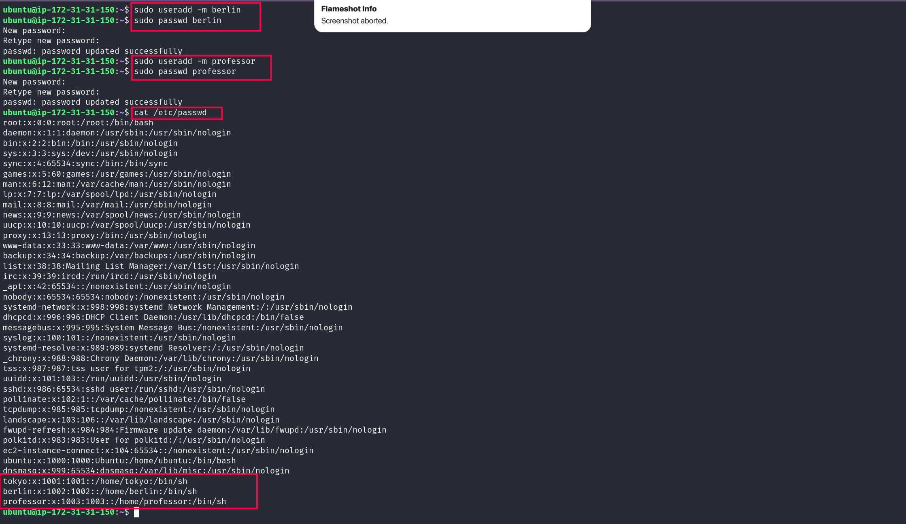
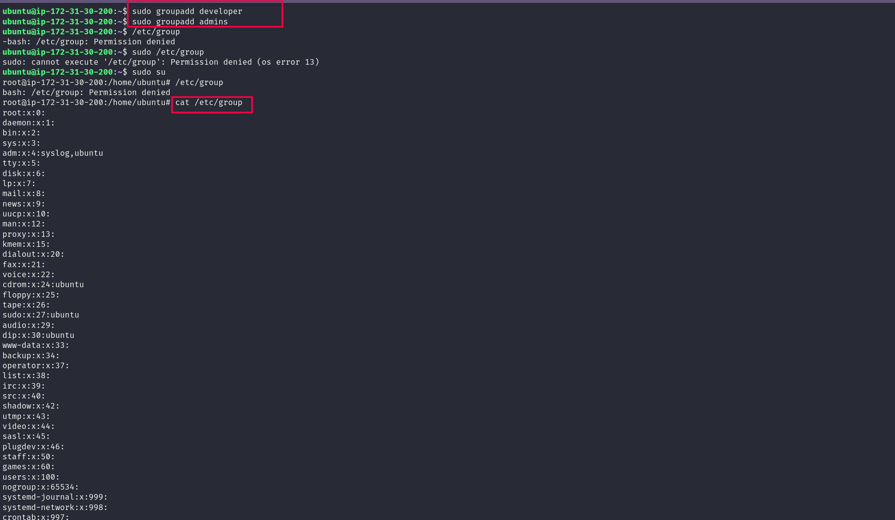
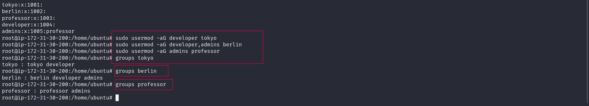
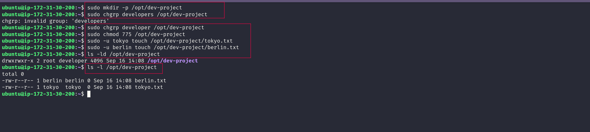
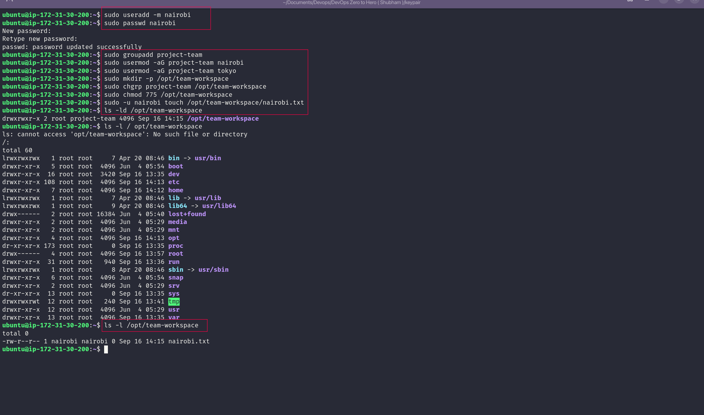

# 🚀 Day 09 – Linux User & Group Management

## 🎯 What I Practiced

Today I worked on some basic Linux administration tasks:

- Creating users
- Creating groups
- Adding users to groups
- Giving a group access to a shared directory
- Testing permissions with different users
- Creating a team workspace

The main idea I learned today was:

**Users → Groups → Permissions → Access**

---

# ✅ Task 1: Create Linux Users

First, I created three users:

- `tokyo`
- `berlin`
- `professor`

I used `-m` with `useradd` so Linux would also create a home directory for each user.

### Commands

```bash
sudo useradd -m tokyo
sudo useradd -m berlin
sudo useradd -m professor
sudo passwd tokyo
sudo passwd berlin
sudo passwd professor

cat /etc/passwd
ls /home
```
### 📸 Screenshot

 

### What I understood
- I learned how to create a new user in Linux.
- The ``-m`` option creates a home directory for the user.
- I used passwd to set a password.
- I checked `/etc/passwd` to see the users.
- I checked `/home` to see their home directories.
---

# ✅ Task 2: Create Groups

I created two groups:

- `developers`
- `admins`

### Commands

```bash
sudo groupadd developers
sudo groupadd admins

cat /etc/group

```

### 📸 Screenshot



### What I understood

- A group is a way to organize users into a team.
- Instead of managing permissions for every user separately, I can give access to the group.
- That becomes much easier to manage when a system has many users.
---

# ✅ Task 3 – Add Users to Groups

Now I connected the users to the groups.

### Commands

```bash
sudo usermod -aG developers tokyo
sudo usermod -aG developers,admins berlin
sudo usermod -aG admins professor

groups tokyo
groups berlin
groups professor
```

### 📸 Screenshot



### Important thing I learned

The `-aG` option is important.

```text
-a = append
-G = supplementary group
```

It means I am adding the user to a supplementary group without removing the groups they already belong to.

For example:

```bash
sudo usermod -aG developers tokyo
```

means:

> Add Tokyo to the developers group.

---

# ✅ Task 4 – Create a Shared Development Directory

Now I created a directory that can be used by the development team.
### Commands Used
```bash
sudo mkdir -p /opt/dev-project

sudo chgrp developers /opt/dev-project
sudo chmod 775 /opt/dev-project

sudo -u tokyo touch /opt/dev-project/tokyo.txt
sudo -u berlin touch /opt/dev-project/berlin.txt

ls -ld /opt/dev-project
ls -l /opt/dev-project
```


### 📸 Screenshot



### What `sudo -u` means

This was useful for testing.

```bash
sudo -u tokyo touch ...
```

means:

> Run this command as the `tokyo` user.

So I could test whether Tokyo actually had permission instead of assuming that the permissions were correct.

### What I understood
- I learned to assigned a directory to a group.
- I learned to set permissions using `chmod`.
- I learned to test access with different users.


---

# ✅ Task 5 – Create a Team Workspace

For the last task, I created another user and another team.

### Commands Used
```bash
sudo useradd -m nairobi
sudo passwd nairobi

sudo groupadd project-team

sudo usermod -aG project-team nairobi
sudo usermod -aG project-team tokyo

sudo mkdir -p /opt/team-workspace

sudo chgrp project-team /opt/team-workspace
sudo chmod 775 /opt/team-workspace

sudo -u nairobi touch /opt/team-workspace/nairobi.txt

ls -ld /opt/team-workspace
ls -l /opt/team-workspace
```

### 📸 Screenshot



### What I understood
- I learned to create a shared team workspace.
- I learned to allow group members to collaborate.
- I learned to verified access by creating files.


# 📚 Commands I Practiced

```bash
useradd
passwd
groupadd
usermod
groups
mkdir
chgrp
chmod
touch
ls
cat
```

# 🔍 My Main Takeaway
- Create and manage users and groups
- Add users to groups with usermod -aG
- Manage ownership with chgrp
- Manage permissions with chmod
- Test user access with sudo -u

# ✅ Day 09 Completed

### Skills Practiced

- Linux User Management
- Linux Group Management
- User and Group Membership
- File and Directory Ownership
- Linux Permissions
- Shared Directory Management
- Basic Access Control
- Permission Testing
