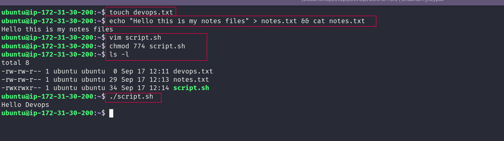
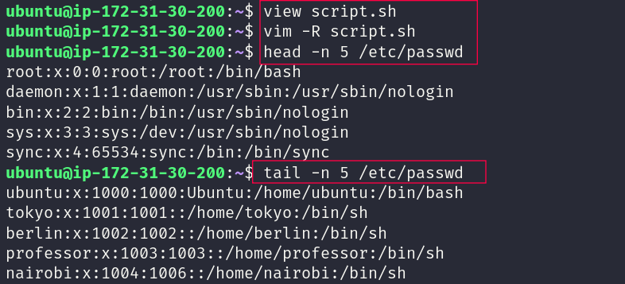
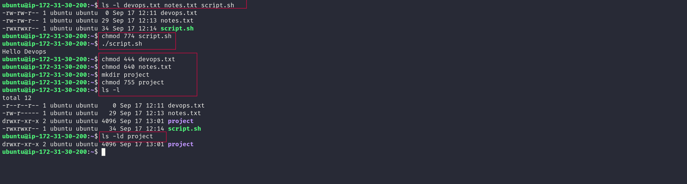
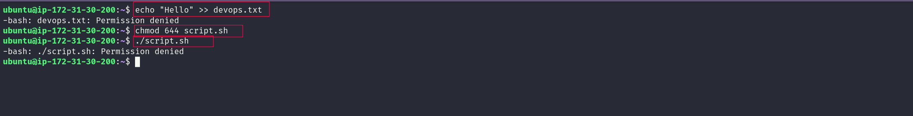

# 🐧 Day 10 – Linux File Permissions & Bash Basics

## 📌 Objective

Today I practiced working with files and permissions directly from a Linux terminal. I created a few files, checked their permissions, changed those permissions with `chmod` and tested what Linux allows or blocks.

---

# ✅ Task 1: Create Files

### Commands Used

```bash
touch devops.txt

echo "Hello this is my notes files" > notes.txt && cat notes.txt

vim script.sh
```

**script.sh**

```bash
#!/bin/bash
echo "Hello DevOps"
```

I then gave the script permission to execute and checked the files:

```bash
chmod 774 script.sh

ls -l
```

After that I ran the script:

```bash
./script.sh
```

### Outcome

* `devops.txt` was created as an empty file
* `notes.txt` was created and filled with a short message
* `script.sh` was created with a simple Bash command
* The script was given `774` permission
* Running `./script.sh` printed `Hello DevOps`
* `ls -l` showed the permission details for all three files

### Screenshot

> 

---

# ✅ Task 2: Read Files

### Commands Used

```bash
view script.sh

vim -R script.sh

head -n 5 /etc/passwd

tail -n 5 /etc/passwd
```

I used a couple of different ways to open the script and then checked the beginning and end of `/etc/passwd`.

### Outcome

* Used `view` to inspect the Bash script
* Used `vim -R` when I wanted the file open in read-only mode
* Used `head -n 5` to see the first five lines
* Used `tail -n 5` to see the last five lines
* Got more familiar with choosing a command based on what part of a file I want to inspect

### Screenshot

> 

---

# ✅ Task 3: Understand Permissions

### Command Used

```bash
ls -l devops.txt notes.txt script.sh
```

### Linux Permission Format

```text
rwxrwxrwx
```

| Symbol | Meaning | Value |
| ------ | ------- | ----: |
| r      | Read    |     4 |
| w      | Write   |     2 |
| x      | Execute |     1 |

Permission groups:

* **Owner** → First three characters
* **Group** → Middle three characters
* **Others** → Last three characters

For example, a permission value of `640` can be read as:

```text
Owner  → rw-
Group  → r--
Others → ---
```

### Outcome

* Started recognizing the permission string from the `ls -l` output
* Understood how the three permission groups are arranged
* Connected numeric values such as `640` with `r`, `w`, and `x`
* Saw why checking permissions is important before trying to change or run a file

---

# ✅ Task 4: Modify Permissions

### Commands Used

```bash
chmod 774 script.sh

./script.sh

chmod 444 devops.txt

chmod 640 notes.txt

mkdir project

chmod 755 project

ls -l

ls -ld project
```

### Outcome

* Kept `script.sh` executable with `774` permission
* Changed `devops.txt` to `444`, so it no longer had write permission
* Set `notes.txt` to **640**
* Created the `project` directory
* Applied **755** permission to the directory
* Used `ls -l` and `ls -ld` to confirm the changes

### Screenshot

> 

---

# ✅ Task 5: Test Permissions

### Commands Used

```bash
echo "Hello" >> devops.txt

chmod 644 script.sh

./script.sh
```

### Expected Errors

When I tried to add more text to `devops.txt` after setting it to `444`, the shell stopped the command:

```text
-bash: devops.txt: Permission denied
```

Then I changed `script.sh` to `644` and tried to run it:

```text
-bash: ./script.sh: Permission denied
```

### Outcome

* Confirmed that removing write permission prevents normal changes to a file
* Confirmed that a script cannot be started with `./script.sh` when execute permission is missing
* Got to see the `Permission denied` message in a real terminal instead of only learning it as a theory

### Screenshot

> 

---

# 🎯 Key Learnings

* File permissions decide what a user is allowed to do with a file
* `chmod` can be used to change permissions in both numeric and symbolic forms
* `ls -l` makes it possible to check file permissions quickly
* `ls -ld` is useful when checking the directory itself
* A Bash script needs execute permission to run it directly with `./script.sh`
* Testing a permission change is a good way to understand what the setting actually does

---

# 📚 Commands Practiced

```bash
touch
echo
cat
view
vim
head
tail
ls -l
ls -ld
chmod
mkdir
./script.sh
```

---

# 🚀 Conclusion

Day 10 helped me make Linux permissions a lot less confusing.

I created the files, changed their permissions and then tried operations that should fail. The terminal responses made it easier to see the connection between a permission value and what I can actually do with a file.

This is a small Linux exercise but it is a useful base for working with scripts, servers, logs, and other files in a DevOps environment.

---
