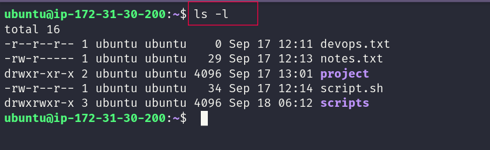
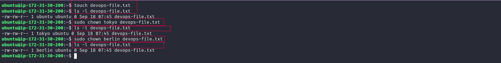
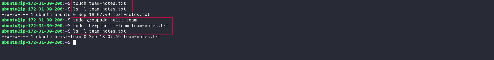
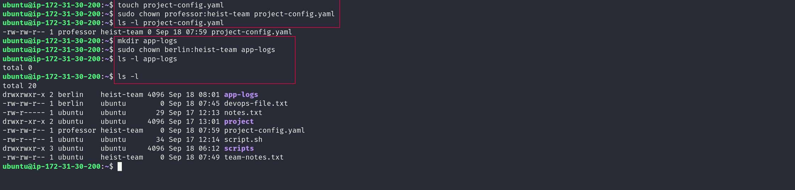
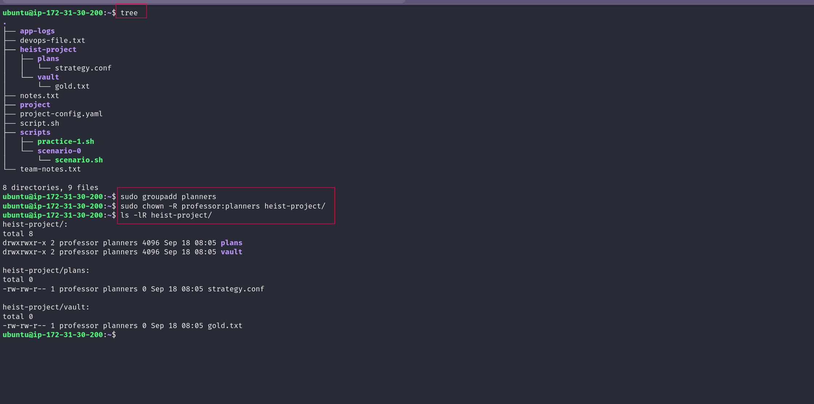
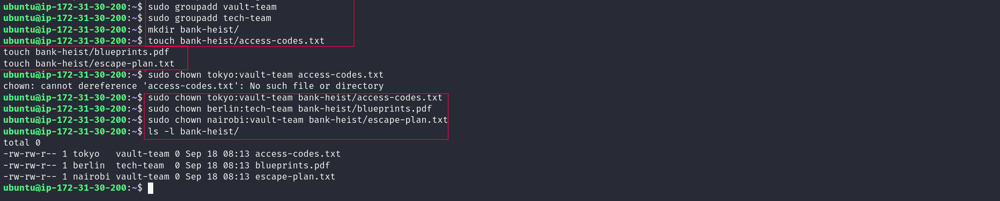

# 🐧 Day 11 – Linux File Ownership (`chown` & `chgrp`)

## 📌 Objective

Today I practiced how Linux handles **file owners and groups**.

I used `chown`, `chgrp`, `useradd`, and `groupadd` to change ownership and manage files and directories.

---

# ✅ Task 1: Check File Ownership

First, I created a file and checked its ownership:

```bash
touch devops-file.txt

ls -l devops-file.txt
```

The output shows:

* **Owner** → user who owns the file
* **Group** → group associated with the file
* **Permissions** → what the owner, group, and others can do
### 📷 Output


---

# ✅ Task 2: Change File Owner with `chown`

I changed the owner of the file from `ubuntu` to `tokyo`, then to `berlin`.

```bash
sudo chown tokyo devops-file.txt

ls -l devops-file.txt

sudo chown berlin devops-file.txt

ls -l devops-file.txt
```

This helped me see how the **owner changes while the group stays the same**.

### 📷 Output



---

# ✅ Task 3: Change Group with `chgrp`

Created a file:

```bash
touch team-notes.txt
```

Created a group:

```bash
sudo groupadd heist-team
```

Changed the group:

```bash
sudo chgrp heist-team team-notes.txt
```

Checked the result:

```bash
ls -l team-notes.txt
```

### 📷 Output



---

# ✅ Task 4: Change Owner and Group Together

Created a file and directory:

```bash
touch project-config.yaml
mkdir app-logs
```

Changed both owner and group:

```bash
sudo chown professor:heist-team project-config.yaml

sudo chown berlin:heist-team app-logs
```

Verified the changes:

```bash
ls -l project-config.yaml
ls -ld app-logs
```

### 📷 Output



---

# ✅ Task 5: Recursive Ownership

Created a small project structure:

```bash
mkdir -p heist-project/vault
mkdir -p heist-project/plans

touch heist-project/vault/gold.txt
touch heist-project/plans/strategy.conf
```

Created a group:

```bash
sudo groupadd planners
```

Changed ownership of the whole project:

```bash
sudo chown -R professor:planners heist-project/
```

Verified everything:

```bash
ls -lR heist-project/
```

`-R` means **recursive**, so the ownership change applies to the directory and everything inside it.

### 📷 Output



---

# ✅ Task 6: Ownership Practice Challenge

Created two groups:

```bash
sudo groupadd vault-team
sudo groupadd tech-team
```

Created the project directory:

```bash
mkdir bank-heist
```

Created three files:

```bash
touch bank-heist/access-codes.txt
touch bank-heist/blueprints.pdf
touch bank-heist/escape-plan.txt
```

Assigned different owners and groups:

```bash
sudo chown tokyo:vault-team bank-heist/access-codes.txt

sudo chown berlin:tech-team bank-heist/blueprints.pdf

sudo chown nairobi:vault-team bank-heist/escape-plan.txt
```

Verified:

```bash
ls -l bank-heist/
```

### 📷 Output



---

# 🧠 One Small Debugging Lesson

At first I used the wrong file path:

```bash
sudo chown tokyo:vault-team access-codes.txt
```

Linux returned:

```text
No such file or directory
```

The file was actually inside `bank-heist/`so the correct command was:

```bash
sudo chown tokyo:vault-team bank-heist/access-codes.txt
```

**Lesson:** Always check the correct file path before running `chown`.

---

# 🎯 Key Commands

| Command                    | What I Learned                     |
| --------------------------- | ----------------------------------- |
| `ls -l`                    | Check owner, group and permissions |
| `chown user file`          | Change file owner                  |
| `chgrp group file`         | Change file group                  |
| `chown user:group file`    | Change owner and group together    |
| `chown -R user:group dir/` | Change ownership recursively       |
| `useradd`                  | Create a user                      |
| `groupadd`                 | Create a group                     |

---

# 📚 Key Takeaways

* Every Linux file has an **owner** and a **group**.
* `chown` changes ownership.
* `chgrp` changes the group.
* `owner:group` lets me change both at once.
* `-R` applies the change to everything inside a directory.
* `ls -l` is the quickest way to verify ownership.
* File paths matter when working with ownership commands.

---

## 🚀 Day 11 Completed

Today I practiced Linux ownership using real files, users, groups, and directories.

**Next step → combine ownership with Linux permissions (`chmod`) and access control.**
