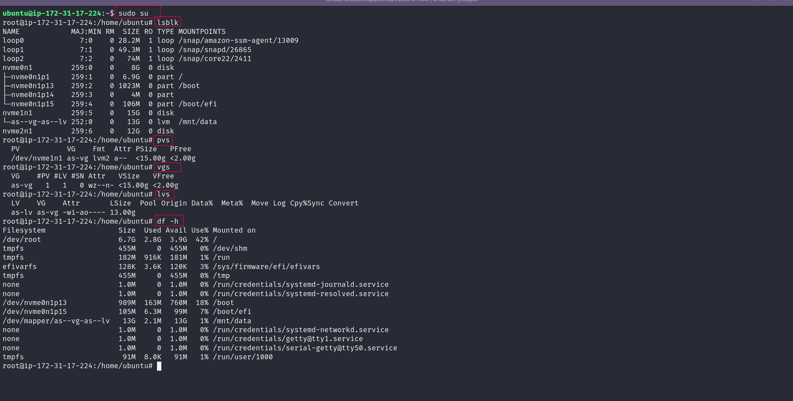
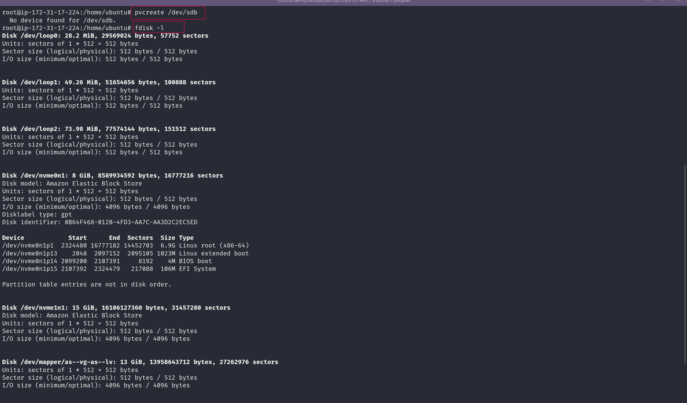
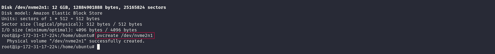
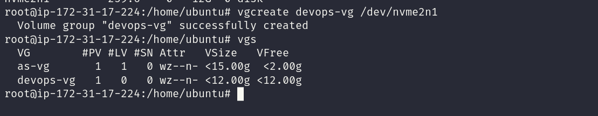
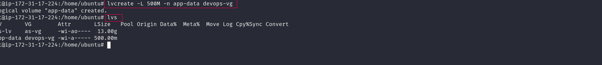
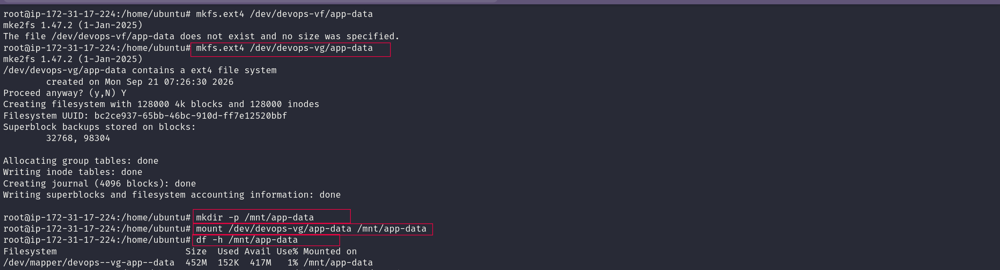
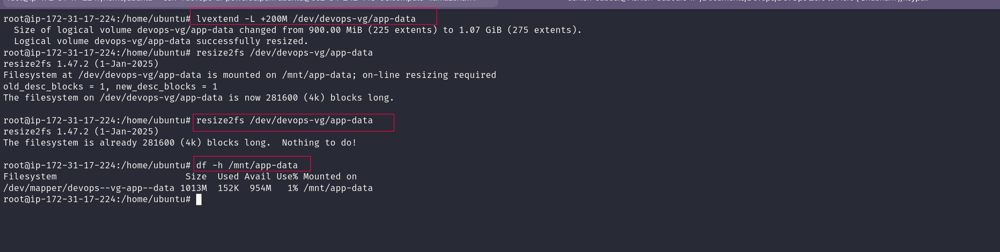

# 🐧 Day 13: Linux Volume Management (LVM)

## What I worked on

Today I spent some time learning **LVM (Logical Volume Management)** on an Ubuntu EC2 machine.

Until now, most of my Linux practice was around files, users, processes, permissions, and services. This time I moved into storage and tried the whole LVM flow myself.

The lab was basically:

```text
disk → PV → VG → LV → ext4 → mount
```

Then I tested what happens when the LV gets bigger.

---

## 1. Check Current Storage

I ran:

```bash
lsblk
pvs
vgs
lvs
df -h
```

A few things stood out in the output:

- `/dev/nvme0n1` is the main system disk.
- `/dev/nvme1n1` was already being used by another LVM setup and mounted on `/mnt/data`.
- `/dev/nvme2n1` was a separate **12 GiB** disk, so I used that for this practice.
- The root filesystem was sitting at about **42% usage**.

### Screenshot



---

## 2. Create Physical Volume

I first tried the example from the lab:

```bash
pvcreate /dev/sdb
```

Ubuntu replied:

```text
No device found for /dev/sdb.
```

So instead of guessing, I checked the disks with:

```bash
fdisk -l
```

That showed:

```text
/dev/nvme2n1
12 GiB
Amazon Elastic Block Store
```

That was the disk I decided to use.

### Screenshots





Then I ran:

```bash
pvcreate /dev/nvme2n1
```

and got a successful result:

```text
Physical volume "/dev/nvme2n1" successfully created.
```

So the disk was ready for LVM.

---

## 3. Create Volume Group

Next I created a volume group called `devops-vg`:

```bash
vgcreate devops-vg /dev/nvme2n1
```

The terminal confirmed:

```text
Volume group "devops-vg" successfully created
```

I checked it with:

```bash
vgs
```

The result showed around **12 GiB free** inside `devops-vg`.

### Screenshot



At this point, the disk was no longer just a standalone device. It had been added to an LVM storage pool.

---

## 4. Create Logical Volume

From that pool, I created a **500 MB** logical volume:

```bash
lvcreate -L 500M -n app-data devops-vg
```

Then I checked:

```bash
lvs
```

The terminal showed `app-data` with a size of **500.00 MiB**.

### Screenshot



This part made the PV → VG → LV relationship much clearer to me.

---

## 5. Format and Mount the Logical Volume

The new LV was only a block device at this point, so I created an ext4 filesystem on it:

```bash
mkfs.ext4 /dev/devops-vg/app-data
```

Then I made a directory for it:

```bash
mkdir -p /mnt/app-data
```

and mounted the volume:

```bash
mount /dev/devops-vg/app-data /mnt/app-data
```

To make sure it was actually working, I checked:

```bash
df -h /mnt/app-data
```

The output showed the filesystem mounted on:

```text
/mnt/app-data
```

with roughly **452 MB** available for use.

### Screenshot



One useful thing I noticed here: the number shown by `df` is not exactly the same as the size I gave to the LV. The filesystem itself uses some space for its own data and metadata.

---

## 6. Extend the Logical Volume

The next part was the one I was most interested in.

I increased the logical volume with:

```bash
lvextend -L +200M /dev/devops-vg/app-data
```

After changing the LV, I resized the ext4 filesystem:

```bash
resize2fs /dev/devops-vg/app-data
```

Then I checked the mount again:

```bash
df -h /mnt/app-data
```

### Screenshot



## How the pieces fit together

This is the flow I practiced today:

```text
/dev/nvme2n1
      │
      ▼
     PV
      │
      ▼
 devops-vg
      │
      ▼
  app-data
      │
      ▼
    ext4
      │
      ▼
/mnt/app-data
```

Thinking about it this way made LVM easier for me to understand.

---

## Commands I used today

```bash
lsblk
pvs
vgs
lvs
df -h
fdisk -l

pvcreate /dev/nvme2n1
vgcreate devops-vg /dev/nvme2n1
lvcreate -L 500M -n app-data devops-vg

mkfs.ext4 /dev/devops-vg/app-data
mkdir -p /mnt/app-data
mount /dev/devops-vg/app-data /mnt/app-data
df -h /mnt/app-data

lvextend -L +200M /dev/devops-vg/app-data
resize2fs /dev/devops-vg/app-data
```

---

## Things that clicked for me today

**1. A disk, an LV, and a filesystem are not the same thing.**  
LVM adds another layer between the physical disk and the filesystem.

**2. Making an LV larger is only half the job.**  
For ext4, the filesystem also needs to be expanded before it can use the extra space.

**3. Real machines don't always look exactly like the tutorial.**  
The tutorial used `/dev/sdb`, but my EC2 instance exposed NVMe device names instead. Checking with `lsblk` and `fdisk` helped me work with the machine I actually had.

---

## Final note

Today's practice gave me a much better idea of how Linux storage can be organized and changed without starting from scratch.

The part I will remember most is:

```text
PV → VG → LV → Filesystem → Mount
```

Another day of **#90DaysOfDevOps** done.

```text
#90DaysOfDevOps #DevOpsKaJosh #TrainWithShubham
```
