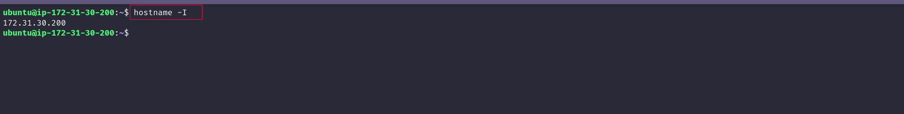
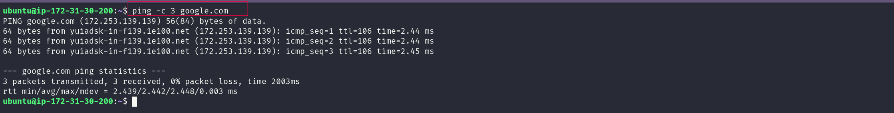
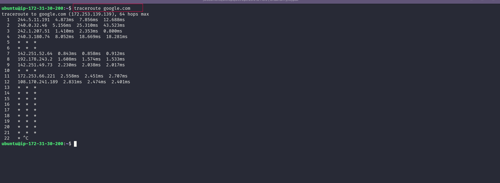
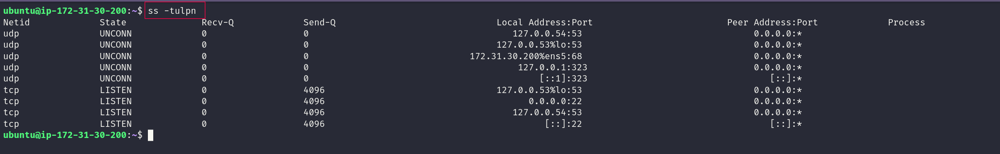
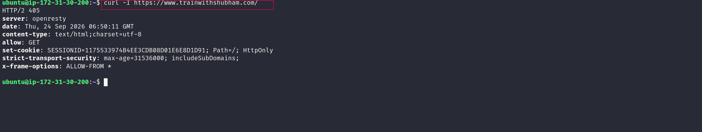
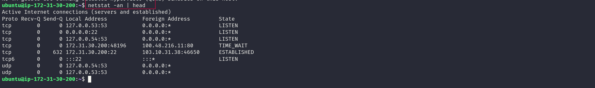
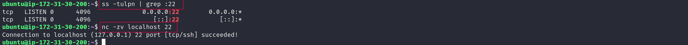

# Day 14: Networking Fundamentals & Hands-on Checks

## 🎯 Objective

Today I practiced core networking concepts and the commands used during basic troubleshooting.

I focused on:
- OSI vs TCP/IP models
- Connectivity and reachability
- Network paths and ports
- DNS name resolution
- HTTP checks
- Listening services and local port probing

---

# 1. Quick Concepts

## OSI vs TCP/IP

### OSI Model (L1–L7)

| Layer | Name | My Understanding |
|---|---|---|
| L7 | Application | User-facing network services such as HTTP, DNS and SSH |
| L6 | Presentation | Data format, End to encryption and encoding |
| L5 | Session | Manages communication sessions and Authentication |
| L4 | Transport | TCP/UDP, ports and reliable delivery |
| L3 | Network | IP addressing,routing,packets |
| L2 | Data Link | Ethernet, MAC addresses and frames |
| L1 | Physical | Cables, radio signals, Router |

### TCP/IP Model

| TCP/IP Layer | Examples |
|---|---|
| Application | HTTP/HTTPS, DNS, SSH |
| Transport | TCP, UDP |
| Internet | IP, ICMP |
| Link | Ethernet, Wi-Fi, ARP |

### Important Mapping

- OSI L1-L2 → TCP/IP Link
- OSI L3 → TCP/IP Internet
- OSI L4 → TCP/IP Transport
- OSI L5-L7 → TCP/IP Application

---

# 2. Where Common Protocols Sit

- **IP** → Network layer / TCP-IP Internet layer
- **TCP/UDP** → Transport layer
- **HTTP/HTTPS** → Application layer
- **DNS** → Application layer

### Real Example

```text
curl https://example.com
        ↓
HTTP/HTTPS Application
        ↓
TCP Transport
        ↓
IP Internet
        ↓
Wi-Fi/Ethernet Link
```

---

# 3. Hands-on Network Check

## 3.1 Identity IP Address

### Command

```bash
hostname -I
```

### Output

```text
172.31.30.200
```

### Screenshot



### Observation

My machine's local IP address is:

```text
172.31.30.200
```

This is the private IP address assigned to my EC2 instance by AWS (on the `172.31.x.x` VPC range), not a public internet-facing IP.

---

## 3.2 Test Reachability

### Command

```bash
ping -c 3 google.com
```

### Screenshot



### Observation

- Packet loss: **0%**
- Average latency: **2.442 ms**
- The host was **reachable**, and the latency was very low, which makes sense since Google runs edge servers close to most networks.

---

## 3.3 Trace Network Path

### Command

```bash
traceroute google.com
```
### Screenshot



### Observation

I got real responses up to about **hop 12** before it fell into a long run of `* * *` and I stopped it manually with `Ctrl+C`.

Long-delay/timeout hops:

```text
Hops 5, 6, 10, and 13–21 all timed out (* * *)
```

> As the lab notes said, `* * *` doesn't necessarily mean the network is broken Google's edge/backbone routers commonly drop or don't respond to ICMP traceroute probes even though the path is fine, which matches what I saw here since `ping` to the same host worked perfectly.

---

## 3.4 Check Listening Ports

### Command

```bash
ss -tulpn
```
### Screenshot



### Observation

One listening service I found:

```text
Service: sshd
Port: 22
Protocol: TCP
```

The output didn't show a process name (I wasn't running as root), but port 22 listening on both `0.0.0.0` and `[::]` is a strong indicator it's SSH. 

---

## 3.5 DNS Name Resolution

### Command

```bash
dig google.com
```


### Screenshot


### Observation

`google.com` resolved to **6 A records** including:

```text
142.251.163.139 (and 5 other addresses in the same range)
```

This confirms DNS resolution is workingnand the query was resolved locally by `systemd-resolved` (`127.0.0.53`) in just 2 msec, meaning it was likely served from cache.

---

## 3.6 HTTP Check

### Command

```bash
curl -I https://www.trainwithshubham.com/
```

### Screenshot



### Observation

HTTP status code:

```text
405 Method Not Allowed
```

This was different from what I expected (a `200 OK`). The `allow: GET` header suggests the server was fine with the request in general, but a `HEAD` request (which `curl -I` sends) may not be supported the same way as `GET` on this particular route the server is still reachable and responding, just not to the exact method I used.

---

## 3.7 Connections Snapshot

### Command

```bash
netstat -an | head
```
### Screenshot



### Rough Count

- ESTABLISHED: **1**
- LISTENING: **4**

### Observation

The snapshot confirms my current SSH session (port 22, `ESTABLISHED`) and shows a leftover `TIME_WAIT` connection on port 80 likely from a recent HTTP request

## 3.8 Port Probe

First identify a listening port:

```bash
ss -tulpn
```

Then test it:

```bash
nc -zv localhost <PORT>
```

If successful the port is reachable. If not, check the service status, firewall, and configuration.

📸 **Screenshot:**
> 

---


## Mini Task: Port Probe & Interpret

> 

---
# 🧠 Reflection

### Fastest troubleshooting commands

```bash
ping <target>
curl -I <URL>
```

Today `ping` came back clean in under 3ms, but `curl -I` on my own site returned a `405` a good reminder that "reachable" and "working correctly" aren't the same thing.

### If DNS fails

Check the **Application layer** and verify resolution using:

```bash
dig <domain>
```

`dig` resolved `google.com` in 2ms flat today, straight from the local resolver cache — DNS wasn't the bottleneck here.

### If HTTP 500 (or any 4xx/5xx) occurs

Check:

* Application logs
* Web server logs (today: `openresty`)
* Whether the request method matches what the route expects

### Follow-up checks

1. Check service status and logs.
2. Check ports, firewall rules, and listening interfaces.

---

## ✅ Key Takeaways

* Got comfortable mapping **OSI vs TCP/IP** layers to real commands instead of just memorizing the diagram
* Practiced **ping, traceroute, ss, dig** and saw firsthand that `traceroute` timeouts don't always mean something's broken
* Ran a real **HTTP check** and got an unexpected `405`, which taught me more than a clean `200` would have
* Confirmed **port 22 (SSH)** is listening and reachable with `nc`
* Walking through a **troubleshooting flow layer-by-layer** feels a lot less overwhelming than guessing
---

**90 Days of DevOps | Networking Fundamentals & Hands-on Checks 🐧**
