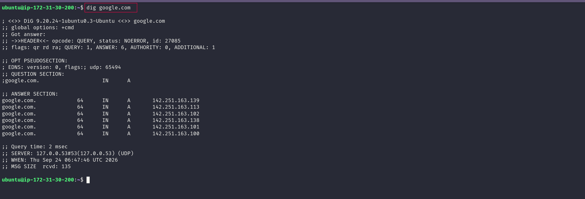
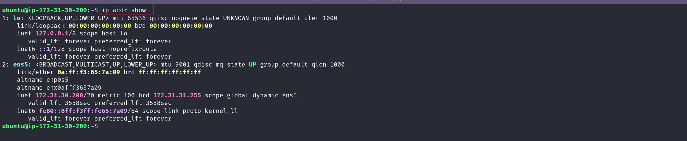

# Day 15: Networking Concepts: DNS, IP, Subnets & Ports

## 📌 Overview

Today I focused on four networking building blocks that are important for a DevOps engineer:

- **DNS** → finds the IP address behind a domain name
- **IP addressing** → identifies network interfaces and destinations
- **CIDR / Subnetting** → defines and divides networks
- **Ports** → identify the network service an application is using

---

# 🔹 Task 1: DNS – How Names Become IPs

## 🧠 Meaning

**DNS (Domain Name System)** works like a phonebook for a network.

Humans use names such as:

```text
google.com
```

Computers communicate using IP addresses such as:

```text
142.251.x.x
```

DNS connects the hostname to the address needed for network communication.

## 🔍 What happens when I type `google.com`?

1. The browser checks whether it already has a cached DNS answer.
2. If needed, the request goes to a **DNS resolver**.
3. The resolver finds the required DNS record and returns an IP address.
4. The browser uses that IP to start a network connection and request the website.

## 📚 DNS Record Types

| Record | What it means |  use |
|---|---|---|
| **A** | Maps a hostname to an IPv4 address | IPv4 web/app endpoints |
| **AAAA** | Maps a hostname to an IPv6 address | IPv6 endpoints |
| **CNAME** | Makes one hostname an alias of another hostname | Useful when a service points to another DNS name |
| **MX** | Identifies mail servers for a domain | Email delivery |
| **NS** | Identifies authoritative name servers | Shows which DNS servers manage the domain |

## 🔧 Command Used

```bash
dig google.com
```

### 🔎 What to find in the output

Look at the **ANSWER SECTION** and find a line like:

```text
google.com.    <TTL>    IN    A    <IPv4-address>
```

My output:

```text
google.com.    268    IN    A    142.251.179.113
```

**A Record:** `142.251.179.113`  
**TTL:** `268 seconds`

###   📸 Screenshot 

> 

---

# 🔹 Task 2: IP Addressing

## 🧠 Meaning

An **IP address** identifies a network interface so devices can send packets toward the correct destination.

### IPv4

IPv4 uses **32 bits**, normally written as four 8-bit octets:

```text
192.168.1.10
```

Each octet can be from `0` to `255`.

```text
192 | 168 | 1 | 10
```

## 🌐 Public vs Private IP

| Type | Meaning | Example |
|---|---|---|
| **Public IP** | Internet-routable address | `8.8.8.8` |
| **Private IP** | Used inside private networks | `192.168.1.10` |

## 🔒 Private IPv4 Ranges

```text
10.0.0.0/8
172.16.0.0/12
192.168.0.0/16
```

Full ranges:

```text
10.0.0.0    → 10.255.255.255
172.16.0.0  → 172.31.255.255
192.168.0.0 → 192.168.255.255
```

## 🔧 Command Used

```bash
ip addr show
```

### 🔎 What to find

Look for lines beginning with `inet`.

Example:

```text
inet 192.168.1.20/24
```

**My Private IPv4:** `172.31.10.220/20`

This address falls inside the private range `172.16.0.0/12`, and the `/20` prefix means 4,096 total IPs in the subnet.


### 📸 Screenshot – `ip addr show`

> 

---

# 🔹 Task 3: CIDR & Subnetting

## 🧠 Meaning

**CIDR** tells us how many bits belong to the **network portion** of an IP address.

Example:

```text
192.168.1.0/24
```

The `/24` means:

```text
24 bits → Network
 8 bits → Host
```

Because IPv4 has 32 bits:

```text
32 - 24 = 8 host bits
```
## 📊 CIDR Table

| CIDR | Network Bits | Host Bits | Subnet Mask | Total IPs | Usable Hosts |
|---|---:|---:|---|---:|---:|
| `/24` | 24 | 8 | `255.255.255.0` | 256 | 254 |
| `/16` | 16 | 16 | `255.255.0.0` | 65,536 | 65,534 |
| `/28` | 28 | 4 | `255.255.255.240` | 16 | 14 |

### 🔎 Quick calculation: `/28`

```text
32 - 28 = 4 host bits

2^4 = 16 total IPs

16 - 2 = 14 usable hosts
```

## 🤔 Why do we subnet?

Subnetting divides a larger network into smaller networks.

It helps with:

- **IP efficiency** → use addresses more appropriately
- **Organization** → separate application components
- **Security** → isolate systems into network segments
- **Routing** → control where traffic moves
- **Cloud design** → create public and private subnets

# 🔹 Task 4: Ports – The Doors to Services

## 🧠 Meaning

An **IP address** identifies the host/interface.

A **port** identifies the service endpoint on that host.

For Example:

```text
IP   = Which host?
Port = Which service?
```

Example:

```text
10.0.1.50:3306
```

means:

```text
10.0.1.50 → destination host
3306      → destination service port
```

## 📚 Common Ports

| Port | Service | Typical DevOps use |
|---:|---|---|
| `22` | SSH | Remote server administration |
| `80` | HTTP | Web traffic |
| `443` | HTTPS | Encrypted web traffic |
| `53` | DNS | Name resolution |
| `3306` | MySQL | Database connections |
| `6379` | Redis | Cache / key-value database |
| `27017` | MongoDB | Document database |

## 🔧 Command Used

```bash
ss -tulpn
```

### 🔎 Listening ports I identified

**Port `22` → `SSH`**  
**Port `53` → `DNS`**

For a focused check:

```bash
sudo ss -tulpn | grep ':22'
```


### 📸 Screenshot – `ss -tulpn`

> 

---

# 🔹 Task 5: Putting It Together

## 1. `curl http://myapp.com:8080`

### 🧠 Explanation

DNS can resolve `myapp.com` to an IP. Port `8080` identifies the application endpoint, and HTTP defines the request/response protocol.

## 2. App cannot reach `10.0.1.50:3306`

### 🧠 Explanation

First check whether the destination is reachable and whether TCP port `3306` can be reached. Then check the database service, bind address, firewall/security rules, and routing.


> **Important:** A successful `ping` only shows that ICMP works. It does not prove that TCP port `3306` is reachable.

---

# 📚 What I Learned

### 1. DNS

DNS lets applications use human-readable names and resolve them to addresses needed for communication.

### 2. CIDR and Subnetting

CIDR describes network size, while subnetting divides networks for organization, security, routing, and efficient address usage.

### 3. Ports

An IP tells me **where to connect**, while a port helps identify **which service** should receive the traffic.

---

# 🛠️ Commands Practiced

```bash
dig google.com
ip addr show
ss -tulpn
```

---

# 🧠 DevOps Networking Cheat Sheet

```text
DNS
└── Name → IP

IP
└── Identifies the host/interface

CIDR
└── Defines network size

Subnet
└── Splits a network into smaller networks

Port
└── Identifies a service endpoint

Socket
└── Communication endpoint used by a process

Route
└── Decides where packets should go

Firewall
└── Controls whether traffic is allowed

Listening
└── Service is waiting for connections
```


---


# ✅ Day 15 Checklist

- [x] Understand DNS resolution
- [x] Understand A, AAAA, CNAME, MX, NS
- [x] Record actual `dig google.com` A record
- [x] Record actual `dig google.com` TTL
- [x] Understand IPv4 structure
- [x] Understand public vs private IPs
- [x] Learn private IPv4 ranges
- [x] Record actual private IP from `ip addr show`
- [x] Understand `/24`, `/16`, and `/28`
- [x] Calculate total and usable IPs
- [x] Understand why subnetting is used
- [x] Learn common service ports
- [x] Identify at least two listening ports from `ss -tulpn`
- [x] Practice application connectivity troubleshooting

---
## 🌐 Learn in Public

```text
#90DaysOfDevOps #DevOpsKaJosh #TrainWithShubham
#DevOps #Networking #Linux #DNS #Cloud #AWS
```
