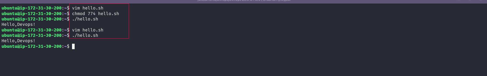
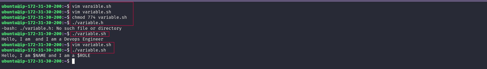
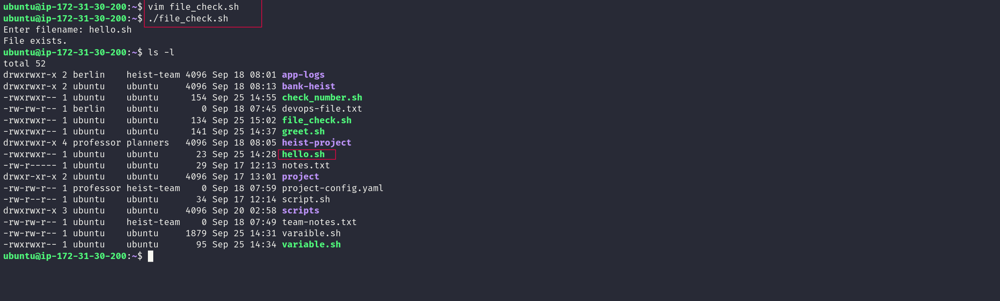
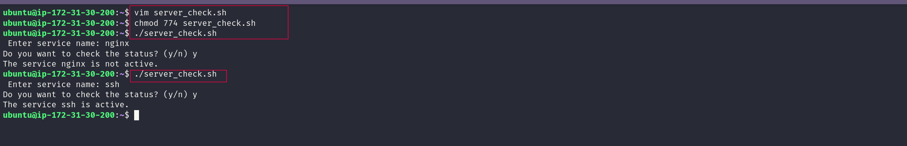

# Day 16: Shell Scripting Basics

## Task 1  First Script

**Script:** `hello.sh`

```bash
#!/bin/bash

echo "Hello, DevOps!"
```

**Output:**

```text
Hello, DevOps!
```

**Note:** The shebang (`#!/bin/bash`) tells Linux which interpreter should be used to execute the script. Without the shebang, the script may still run when invoked by another shell, but the script no longer explicitly defines its intended interpreter.

**Screenshot:**
> 

------------------------------------------------------------------------

## Task 2  Variables

**Script:** `variables.sh`

```bash
#!/bin/bash

NAME="Ashish"
ROLE="DevOps Engineer"

echo "Hello, I am $NAME and I am a $ROLE"
```

**Output:**

```text
Hello, I am Ashish and I am a DevOps Engineer
```

**Note:** Variables store values that can be reused in a script. Double quotes expand variables, while single quotes treat the text literally.

For example:

```bash
echo "Hello $NAME"
echo 'Hello $NAME'
```

Output:

```text
Hello Ashish
Hello $NAME
```

**Screenshot:**
> 

------------------------------------------------------------------------

## Task 3  User Input

**Script:** `greet.sh`

```bash
#!/bin/bash

read -p "Enter your name: " name
read -p "Enter your favourite tool: " tool

echo "Hello $name, your favourite tool is $tool"
```

**Output:**

```text
Enter your name: Ashish
Enter your favourite tool: Docker
Hello Ashish, your favourite tool is Docker
```

**Note:** `read` is used to take input from the user and store it in a variable.

**Screenshot:**
> 

------------------------------------------------------------------------

## Task 4  If-Else Conditions

### `check_number.sh`

```bash
#!/bin/bash

read -p "Enter a number: " num

if [ "$num" -gt 0 ]; then
    echo "Positive"
elif [ "$num" -lt 0 ]; then
    echo "Negative"
else
    echo "Zero"
fi
```

**Note:** `if`, `elif`, and `else` allow a shell script to make decisions based on conditions.

**Screenshot:**
> 

### `file_check.sh`

```bash
#!/bin/bash

read -p "Enter filename: " file

if [ -f "$file" ]; then
    echo "File exists."
else
    echo "File does not exist."
fi
```

**Note:** `-f` checks whether the given path exists and is a regular file. Quoting `"$file"` is safer when filenames contain spaces.

**Screenshot:**
> 

------------------------------------------------------------------------

## Task 5  Combine It All

### `server_check.sh`

```bash
#!/bin/bash

read -p "Please Enter service name: " service
read -p "Do you want to check the status? (y/n) " choice

if [ "$choice" = "y" ]; then
    if systemctl is-active "$service" > /dev/null 2>&1; then
        echo "The service $service is active."
    else
        echo "The service $service is not active."
    fi
elif [ "$choice" = "n" ]; then
    echo "Skipped."
else
    echo "Invalid choice."
fi
```

**Output:**

```text
Please Enter service name: nginx
Do you want to check the status? (y/n) y
The service nginx is active.
```

**Note:** This combines variables, user input, conditions, and `systemctl`.

The `> /dev/null 2>&1` redirects both the normal output and error messages of `systemctl is-active` so only the message from the script is displayed. The command's exit status is still used by the `if` condition to determine whether the service is active.

**Screenshot:**
> 

------------------------------------------------------------------------

## What I Learned

1. **Shebang** -- Defines the interpreter used to execute a script.
2. **Variables & `read`** -- Store values and take input from the user.
3. **Conditions** -- Use `if-elif-else` and command exit status to make decisions.

