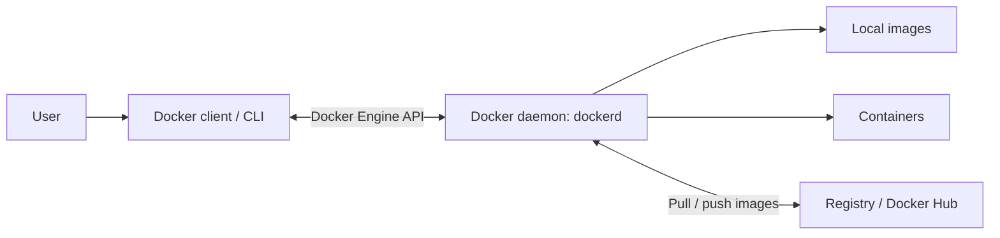

# Day 29 Introduction to Docker
## Overview

Practise Docker containerization, compare containers with virtual machines, inspect Docker architecture, and run basic container lifecycle commands.

## Learning Objectives

- Explain containers, virtual machines, and Docker architecture.
- Verify Docker and run the `hello-world` image.
- Run and inspect Ubuntu and Nginx containers.
- Practise detached mode, naming, port publishing, logs, `docker exec`, stopping, and removing containers.

---

## Task 1: What Is Docker?

### Step 1: What is Docker and why do we need it?

- **Docker** is a containerization platform for packaging applications and their dependencies into images.
- A **container** runs an application in an isolated environment with its own process view, filesystem, and networking.
- Containers help reduce the **“works on my machine”** problem caused by differences in dependencies, software versions, and configuration.
- Containers share the host OS kernel, so they usually have less overhead than virtual machines. They do not automatically reserve a fixed amount of RAM; resource limits can be configured when needed.
- Consistent images support repeatable deployments and **CI/CD pipelines**.

### Step 2: Compare containers and virtual machines

| Feature | Containers | Virtual machines |
|---|---|---|
| Virtualization | Operating-system level | Hardware level using a hypervisor |
| Kernel / OS | Share the host kernel | Each VM runs a guest OS and its own kernel |
| Resource overhead | Usually lower | Usually higher |
| Startup | Usually faster | Usually slower |
| Isolation | Process and namespace isolation | Separate guest OS and virtual hardware |

### Step 3: Identify Docker architecture components

- **Docker client (`docker` CLI):** Sends commands such as `docker run`, `docker ps`, and `docker logs`.
- **Docker daemon (`dockerd`):** Receives Docker API requests and manages images, containers, networks, and volumes.
- **Image:** A reusable, read-only template used to create containers.
- **Container:** A running or stopped instance of an image.
- **Registry:** Stores and distributes images. Docker Hub is a public registry.

### Step 4: Describe the architecture



**How `docker run` works:** The client sends the command to the daemon. The daemon checks for the image locally, pulls it from a registry if necessary, and creates and starts a container.

---

## Task 2: Install and Verify Docker

### Step 1: Install Docker if it is not already installed

Docker was already installed on the EC2 instance shown in the supplied terminal screenshots. If setting up a new Ubuntu machine, install it with:

```bash
sudo apt update
sudo apt install -y docker.io
sudo systemctl enable --now docker
```

### Step 2: Allow the current user to run Docker

```bash
sudo usermod -aG docker "$USER"
newgrp docker
```

`usermod -aG docker "$USER"` adds the current user to the `docker` group. `newgrp docker` activates the group in a new shell; alternatively, log out and sign in again. **Docker group membership grants root-equivalent privileges on the host. Add only trusted users.**

### Step 3: Verify Docker

```bash
docker --version
docker ps
docker info
sudo systemctl status docker
```

The screenshot showed this Docker version:

```text
Docker version 29.1.3, build 29.1.3-0ubuntu4.1
```

The initial `docker ps` output showed no running containers.

### Step 4: Run the `hello-world` container

**First attempt (failed because a space was used in the image name):**

```bash
docker run hello world
```

Docker tried to find `hello:latest` and returned a pull-access error.

**Correct command (succeeded):**

```bash
docker run hello-world
```

Docker pulled the `hello-world` image from Docker Hub, created a container, printed `Hello from Docker!`, and exited successfully.


---

## Task 3: Run Containers

### Step 1: Run an Nginx container

**Command executed:**

```bash
docker run -d --name ashish-nginx nginx
```

The container started in detached mode. The screenshot showed `ashish-nginx` running with `80/tcp`, but no host port was published.

### Step 2: List the running container and inspect its logs

```bash
docker ps
docker logs ashish-nginx
```

The logs showed Nginx entrypoint configuration and startup messages.


### Step 3: Practise port mapping

A second attempt to reuse `ashish-nginx` failed because the name was already in use:

```bash
docker run -d --name ashish-nginx -p 8080:80 nginx
```

The following command was then executed successfully:

```bash
docker run -d --name Ashis-Nginx -p 8080:81 nginx
```

**Observation:** This mapped host port `8080` to container port `81`. The default Nginx image listens on container port `80`, so use `80` as the container port to reach the default welcome page.

For a corrected test, first check whether the name and port are available, then run:

```bash
docker ps -a
docker run -d --name nginx-port-test -p 8080:80 nginx
curl http://localhost:8080
```

If `nginx-port-test` or host port `8080` is already in use, remove the old test container or select another host port. On EC2, access from your computer also requires an inbound TCP `8080` security-group rule restricted to a trusted source IP. A browser screenshot was not included in the supplied evidence.


### Step 4: Run Ubuntu in interactive mode

**Command executed:**

```bash
docker run -it ubuntu
```

Inside the container, these commands were run:

```bash
whoami
cat /etc/os-release
pwd
ls -ltha
```

The screenshot showed user `root`, Ubuntu `26.04.1 LTS`, and `/` as the working directory. The `-it` flags provide interactive input and a terminal. Type `exit` to leave the shell; the container stops when its main shell exits.


### Step 5: List running and all containers

```bash
docker ps
docker ps -a
```

- `docker ps` lists running containers.
- `docker ps -a` lists running and stopped containers.


### Step 6: Stop and remove a container

The screenshots show these commands and outcomes:

```bash
docker stop nginx
# Failed: no container named "nginx" was found.

docker stop fb7893269866
# Succeeded: stopped the container identified by this ID.

docker rm -r fb7893269866
# Failed: docker rm does not support the -r shorthand.

docker rm fb7893269866
# Succeeded: removed the stopped container.
```

**Lesson learned:** Use the exact container name or ID, not just the image name. `docker rm` removes a stopped container and does not use the `-r` option.

---

## Task 4: Explore Docker

### Step 1: Run a container in detached mode and give it a name

```bash
docker run -d --name ashish-nginx nginx
```

- `-d` starts the container in the background and returns the terminal prompt.
- `--name ashish-nginx` assigns a predictable name.
- The screenshot showed a name conflict when the same name was reused. Check containers with `docker ps -a` before reusing a name.

### Step 2: Map a port from the host to the container

The command below maps host port `8080` to Nginx container port `80`:

```bash
docker run -d --name nginx-demo -p 8080:80 nginx
```

Then test the endpoint from the Docker host:

```bash
curl http://localhost:8080
```

Use a different available host port if `8080` is already occupied. For the observed command and result, see the port-mapping screenshot in Task 3.

### Step 3: Check logs

```bash
docker logs ashish-nginx
```

Follow new log entries in real time with:

```bash
docker logs -f ashish-nginx
```

Press `Ctrl+C` to stop following logs; this does not stop the container.

### Step 4: Run a command inside a running container

These attempts failed because the supplied names did not exist:

```bash
docker exec -it task4-nginx /bin/sh
# Failed: no container named "task4-nginx".

docker exec task4 ls -la
# Failed: no container named "task4".
```

Using the actual running container name succeeded:

```bash
docker exec ashish-nginx ls -la
```

`docker exec` runs a command inside an **already running** container; it does not create a new container. To open an interactive shell in the Nginx image, use:

```bash
docker exec -it ashish-nginx /bin/sh
```


### Step 5: Clean up practice containers

Check names and statuses first:

```bash
docker ps -a
```

Stop running test containers and remove them when no longer needed. Example:

```bash
docker stop nginx-demo
docker rm nginx-demo
```

If a container is already stopped, skip `docker stop` and run `docker rm <container-name>` directly. Do not remove containers that are still needed.

---

## Quick Reference

| Command | Purpose |
|---|---|
| `docker --version` | Display the installed Docker version |
| `docker run hello-world` | Test Docker by running the test image |
| `docker run -it ubuntu` | Start Ubuntu with an interactive terminal |
| `docker run -d --name NAME IMAGE` | Start a named container in detached mode |
| `docker run -d --name NAME -p 8080:80 nginx` | Publish Nginx container port `80` on host port `8080` |
| `docker ps` / `docker ps -a` | List running / all containers |
| `docker logs CONTAINER` | Display container logs |
| `docker exec CONTAINER COMMAND` | Run a command inside a running container |
| `docker stop CONTAINER` | Stop a running container |
| `docker rm CONTAINER` | Remove a stopped container |

## Key Takeaways

- Images are templates; containers are instances of images.
- Containers share the host kernel and usually have less overhead than VMs, but they still use host CPU and memory.
- Use the exact container name or ID with `docker logs`, `docker exec`, `docker stop`, and `docker rm`.
- Port publishing must target the port on which the application listens inside the container.
- Containers can be recreated; use volumes or external storage for data that must persist.

## Submission Checklist

- [ ] Save this file as `2026/day-29/day-29-docker-basics.md`.
- [ ] Keep the supplied screenshots in `2026/day-29/images/` with the referenced filenames.
- [ ] Complete the corrected Nginx browser check and capture a screenshot if required by the task.
- [ ] Commit and push the changes to the fork.

```bash
git add 2026/day-29/
git commit -m "Add Day 29 Docker basics notes"
git push
```
